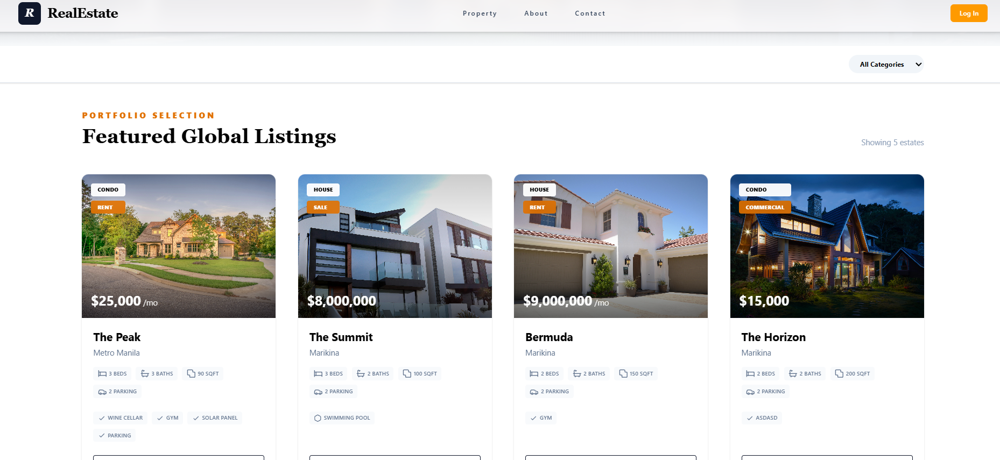

# 🌐 Real Estate Project

🔗 **Live Site:** https://www.ematsproject.store/

Real Estate Project App is a full-stack MERN web application built with modern technologies, featuring secure authentication, email integration, cloud-based image handling, map-based property viewing, virtual property tours via YouTube, and a complete Admin CMS system.

The application demonstrates strong full-stack fundamentals, secure authentication workflows, and scalable backend architecture.

---

## 📸 Screenshot

## 🚀 Tech Stack

### 🖥 Frontend
- React.js
- Tailwind CSS
- Axios
- React Toastify
- Framer Motion

### 🌍 Backend
- Node.js
- Express.js
- MongoDB

### 🔐 Authentication & Security
- JWT (JSON Web Token)
- bcrypt (Password Hashing)
- crypto

### ☁️ Cloud & Services
- Cloudinary – Cloud image storage & optimization
- Resend – Email service integration
- YouTube Embed Integration – Virtual property tours
- Google Map Embedded URL

---

## ✨ Features

### 👥 User Features
- 🔐 Secure user authentication (JWT + bcrypt)
- 🏘 Property browsing with detailed listings
- 🗺 Interactive Map View for property locations
- 🎥 Virtual Property View via embedded YouTube videos
- 📩 Inquiry submission system
- 📧 Email notifications (Resend)
- 🔔 Real-time toast notifications
- 🎨 Fully responsive design (Tailwind CSS)
- 🎥 Smooth UI animations (Framer Motion)

### 🛠 Admin CMS Features
- 🔑 Role-based admin access
- 🏘 Manage Properties (Create, Update, Delete)
- 🗺 Add property location for Map View
- 🎥 Add YouTube virtual tour links
- 👨‍💼 Manage Agents (Create, Update, Delete)
- 📩 Manage Inquiries
- 👥 Manage Users
- ☁️ Cloud-based image uploads via Cloudinary
- 📊 Centralized dashboard for full platform control

---

## 🏗 Project Architecture

This project follows the MERN stack architecture:

- MongoDB – Database
- Express.js – Backend framework
- React.js – Frontend UI
- Node.js – Runtime environment

The system implements role-based access control (RBAC) using JWT to secure admin routes and CMS operations.

---

## 🚀 Deployment

- Frontend: Vercel
- Backend: Render
  
---

## 👨‍💻 Author

Raymart S.
Philippines 🇵🇭
